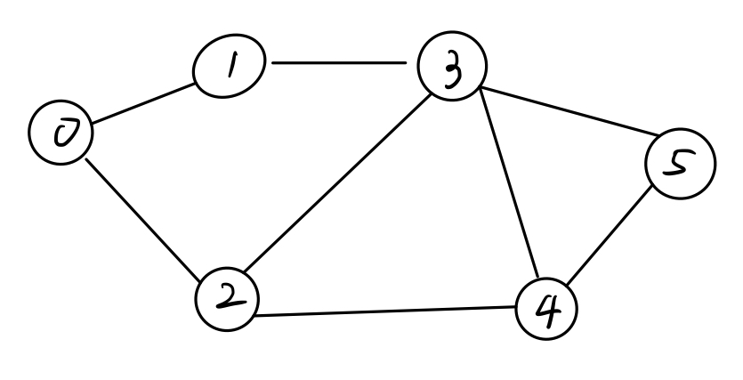

# Graph search

<p align = "center">
    
</p>

### Breadth first search
```
BFS(graph G, start vertex S)
    mark S as explored 
    Let Q = queue data structure (FIFO), initialized with S
    while Q is not empty:
        remove the first node of Q, call it v
        for each edge (v, w):
            if w unexplored:
                mark w as explored
                add w to Q (at the end)
```

### Depth first search
- stack version
```
DFS(graph G, start vertex S)
    Let St = stack data structure (LIFO), initialized with S
    while St is not empty:
        remove the top node of St, call it v
        if v unexplored:
            mark v explored
            for every edge (v, w):
                if w unexplored:
                    push w to St
```
- recursive version
```
DFS(graph G, start vertex S)
    mark S as explored
    for every edge (S, v):
        if v unexplored:
            DFS(G, v)
```